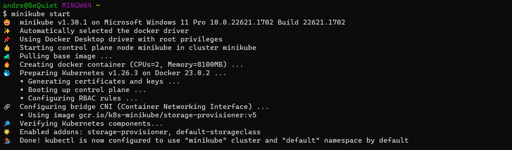

# Final Project Assessment for Scalefocus Academy
## 1. Setting up a kubernetes cluster using minikube
While running the Docker we can type "minikube start" to initialize minikube

    minikube start

## 2. Install helm and kubectl
## 3. Download helm charts from bitnami 

        https://github.com/bitnami/charts.git

## 4. Change service type in values.yaml file in the wordpress chart to ClusterIP

## 5. Set up jenkins locally on linux VM
Create a new job as a pipeline

Create a new pipeline with following code

        pipeline {
                agent any

                stages {
                        stage('Namespace') {
                        steps {
                                script {
                                sh 'kubectl create namespace wp'
                                }
                                }
                        }

                        stage('Check WordPress') {
                        steps {
                                script {
                                def wordpressExists = sh(script: "helm ls --namespace wp --all | grep -w 'final-project-wp-scalefocus' | wc -l", returnStdout: true).trim()
                                if (wordpressExists == "1") {
                                        echo "WordPress Helm chart already installed"
                                } else {
                                        echo "WordPress Helm chart not found. Installing..."
                                        sh "helm install final-project-wp-scalefocus /home/jenkins/wordpress -n wp"
                                }
                                }
                        }
                        }
                }
        }
Test if the pipeline works

Run the pipeline to create the wordpress website

## 6. Check if the pods were created

## 7. Port-forward the wordpress pod to localhost:9090

        kubectl port-forward "pod-name" -n wp 9090:80
        
## 8. Enjoy the wordpress page in your browser

